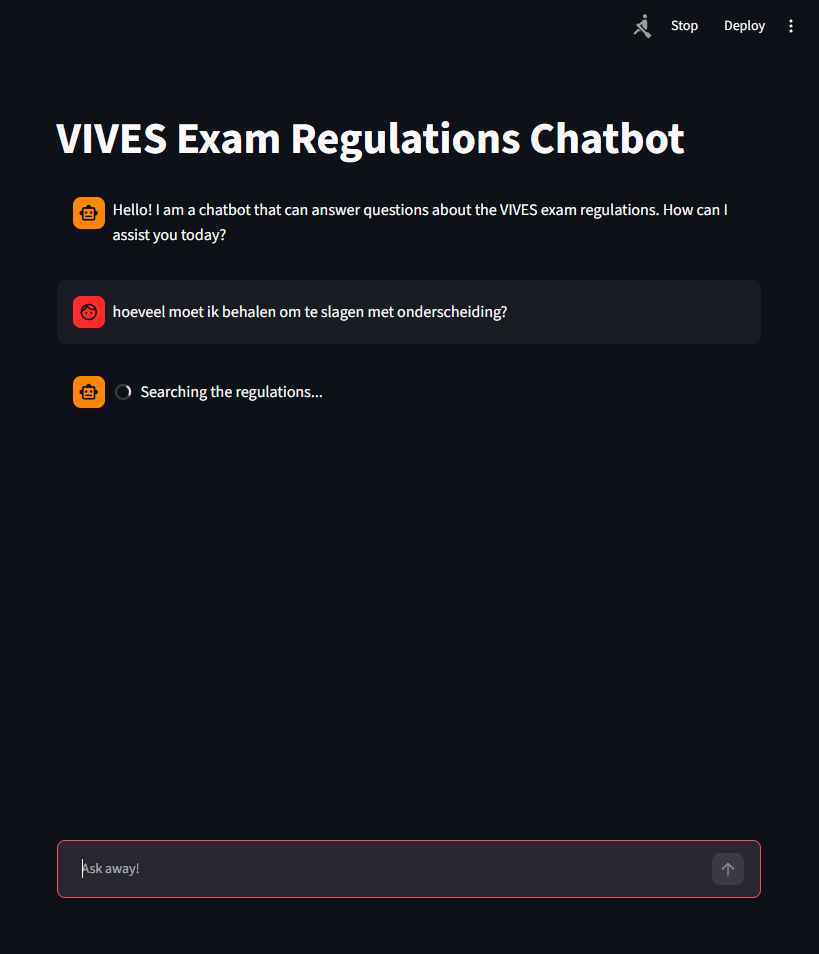

# VIVES Exam Regulations Chatbot

A RAG (Retrieval-Augmented Generation) chatbot that answers questions about the VIVES exam regulations, based on the PDF documents I provided. It remembers the conversation, so follow-up questions work.

## How it works

1. **Ingest** (`create_db.py`): loads the PDFs, splits them into chunks, embeds them locally with GPT4All and stores them in a Chroma vector database.
2. **Retrieve** (`lanchain_helper.py`): rewrites follow-up questions into standalone ones, then finds the 3 most relevant chunks.
3. **Answer**: Gemini writes a short answer using only those chunks, and says it doesn't know if the answer isn't in them.
4. **Chat** (`main.py`): a Streamlit interface. LangGraph keeps the chat history.

## Tech stack

Python, LangChain, LangGraph, Chroma, GPT4All embeddings, Google Gemini, Streamlit

## Picture
